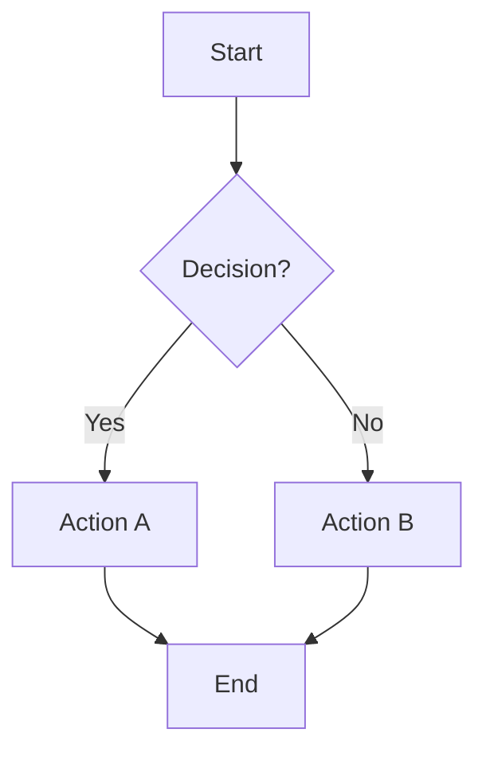
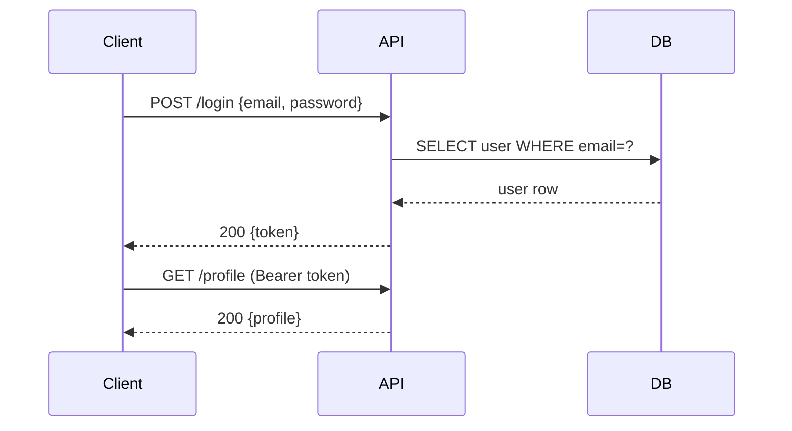
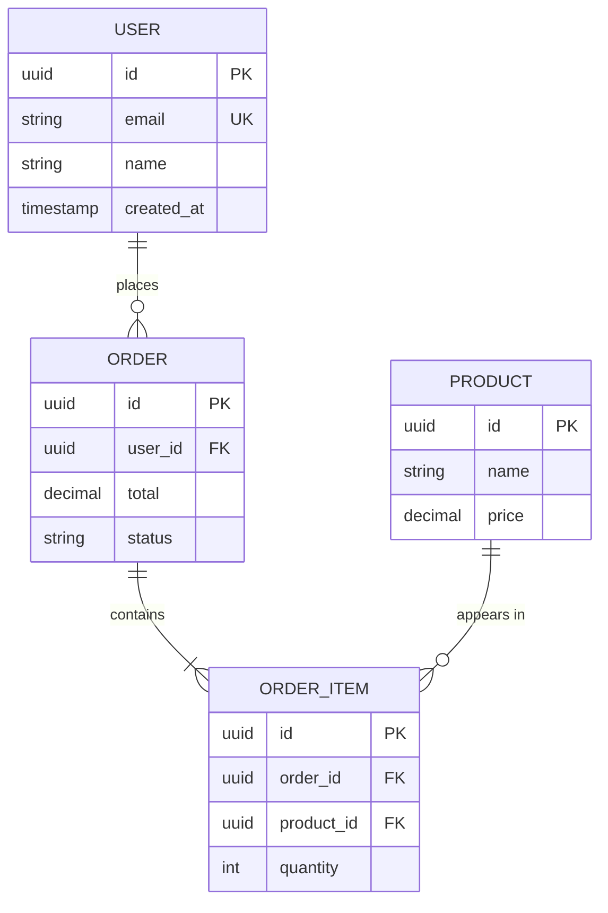
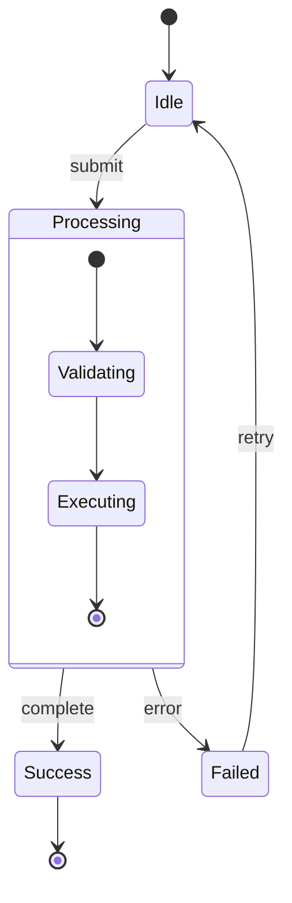
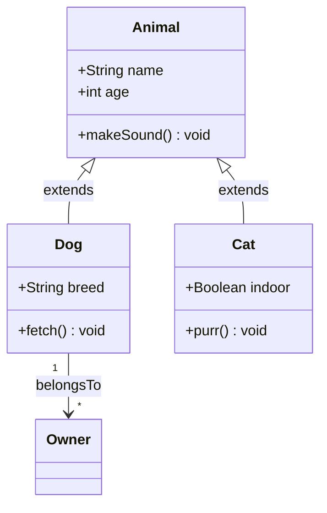
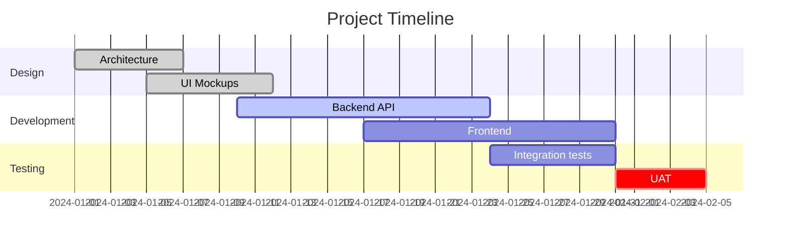
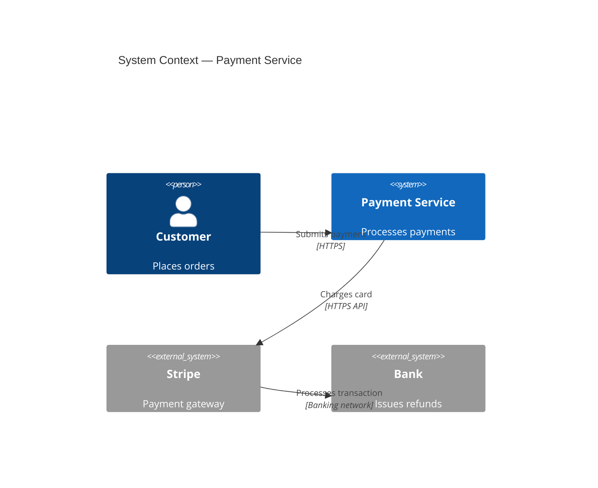
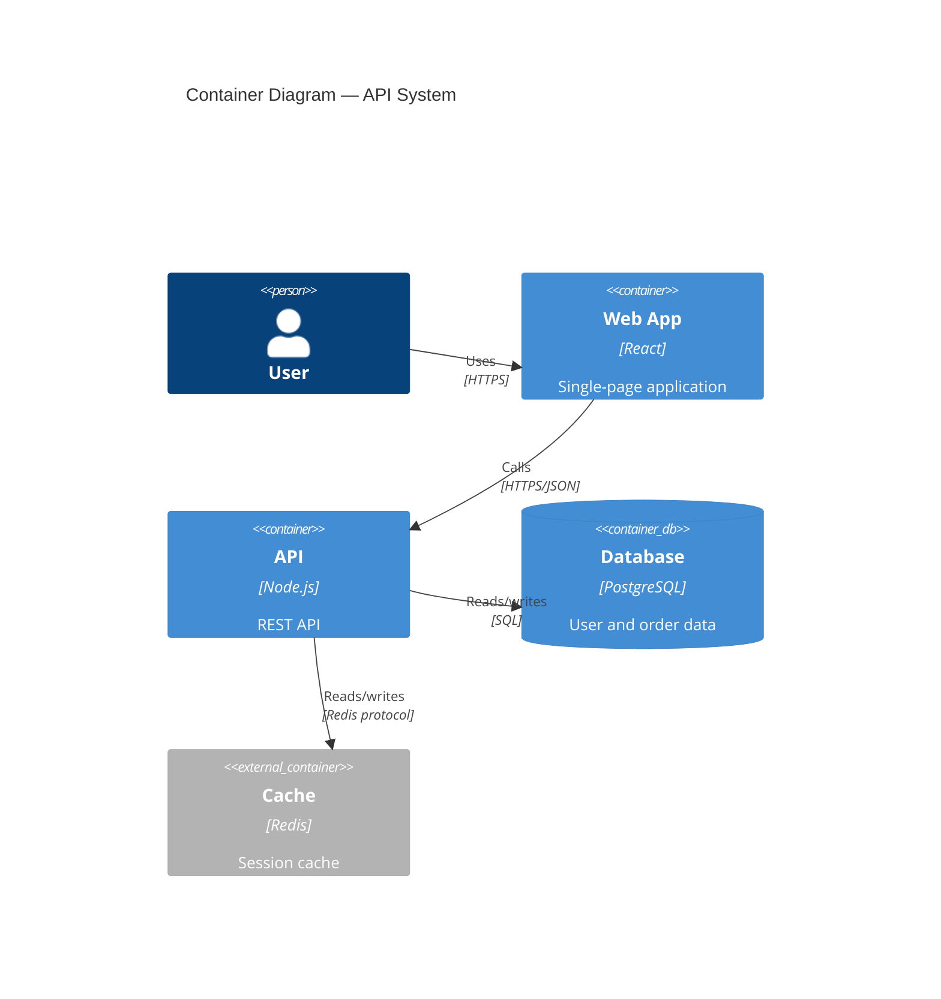

<!-- ported from mercure-plugin/skills/diagram-mermaid/ -->

# Mermaid Diagrams

**triggers**: Documenting architecture, illustrating a workflow, mapping state transitions,
showing sequence of API calls, creating an ER diagram, Gantt chart for a project plan

## Quick Reference

Mermaid diagrams are embedded in Markdown code blocks:

````markdown
```mermaid
{diagram content}
```
````

## Flowchart



### Syntax

```
flowchart {direction}
```

| Direction | Meaning |
|-----------|---------|
| `TD` / `TB` | Top-down |
| `LR` | Left-right |
| `RL` | Right-left |
| `BT` | Bottom-top |

**Node shapes**:
```
A[Rectangle]
B(Rounded)
C{Diamond / Decision}
D((Circle))
E>Asymmetric]
F[(Database)]
G[[Subprocess]]
```

**Edge types**:
```
A --> B         Arrow
A --- B         Line (no arrow)
A -.-> B        Dotted arrow
A ==> B         Thick arrow
A -->|label| B  Arrow with label
```

**Subgraphs**:
```
subgraph title
  A --> B
end
```

## Sequence Diagram



### Syntax

```
sequenceDiagram
    participant A
    participant B

    A->>B: message           Solid arrow
    A-->>B: message          Dotted arrow (response)
    A-x B: message           Cross-end (async, fire-and-forget)
    A-)B: message            Open arrow (async)

    Note over A,B: text      Note spanning participants
    Note right of B: text    Note on one side

    loop {label}
      A->>B: retry
    end

    alt {condition}
      A->>B: path 1
    else {other}
      A->>B: path 2
    end

    opt {optional}
      A->>B: optional path
    end
```

## Entity-Relationship Diagram



### Relationship Notation

```
||  Exactly one
|{  One or more
o|  Zero or one
o{  Zero or more
```

```
A ||--|| B     One-to-one
A ||--|{ B     One-to-many
A |o--o{ B     Zero-or-one to zero-or-many
```

## State Diagram



### Syntax

```
stateDiagram-v2
    [*] --> State1      Initial transition
    State1 --> [*]      Terminal transition
    State1 --> State2 : event label
    State1 --> State2 : event [guard]

    state "Long name" as SN

    state ForkState <<fork>>
    state JoinState <<join>>
```

## Class Diagram



### Relationship Types

| Symbol | Meaning |
|--------|---------|
| `<|--` | Inheritance |
| `*--` | Composition |
| `o--` | Aggregation |
| `-->` | Association |
| `..>` | Dependency |
| `..` | Link (plain) |

### Visibility

| Symbol | Visibility |
|--------|-----------|
| `+` | Public |
| `-` | Private |
| `#` | Protected |
| `~` | Package |

## Gantt Chart



### Task States

| State | Meaning |
|-------|---------|
| `done` | Completed |
| `active` | In progress |
| `crit` | Critical path |
| (none) | Planned |

## C4 Architecture Diagrams

### Context Diagram (C4)



### Container Diagram (C4)



## Diagram Best Practices

1. **Left-to-right for processes**: `LR` direction reads naturally for workflows
2. **Top-down for hierarchies**: `TD` for trees, org charts, class hierarchies
3. **Keep it focused**: One concept per diagram — split large diagrams
4. **Label relationships**: Unlabeled edges often need more context
5. **Use subgraphs for grouping**: Cluster related nodes visually
6. **Consistent naming**: Use the same names as in code (`UserService`, not `User Service`)
7. **Add a title**: Use `---\ntitle: Name\n---` frontmatter or inline title

## Common Mistakes

| Mistake | Fix |
|---------|-----|
| Quotes in node labels | Use `["text with spaces"]` not bare text with spaces |
| Special characters breaking parse | Wrap label in quotes: `A["text & text"]` |
| Arrow direction reversed | Check `A --> B` direction; swap if needed |
| Diagram too wide | Switch to `TD` or split into subgraphs |
| Missing `end` for subgraph | Always close `subgraph` with `end` |
| `stateDiagram` vs `stateDiagram-v2` | Use `v2` — it supports nested states |
